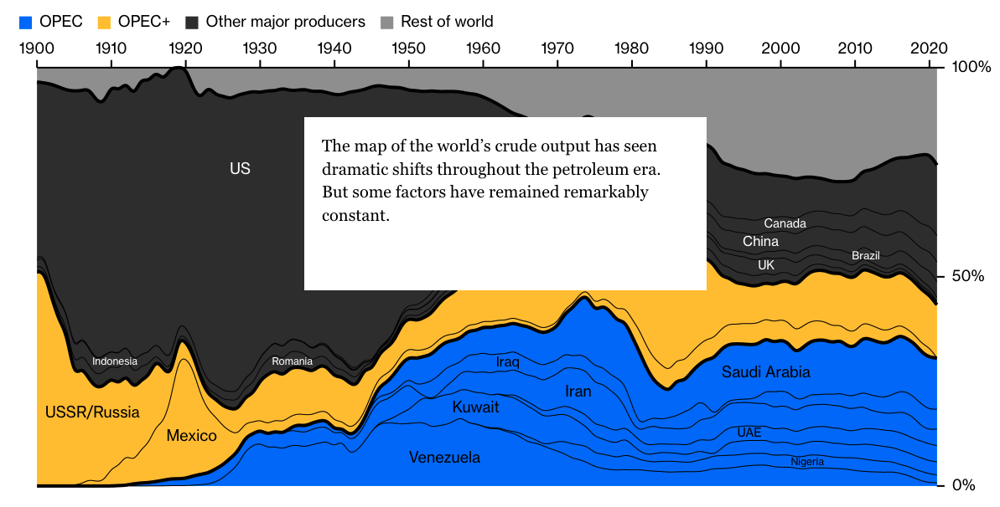
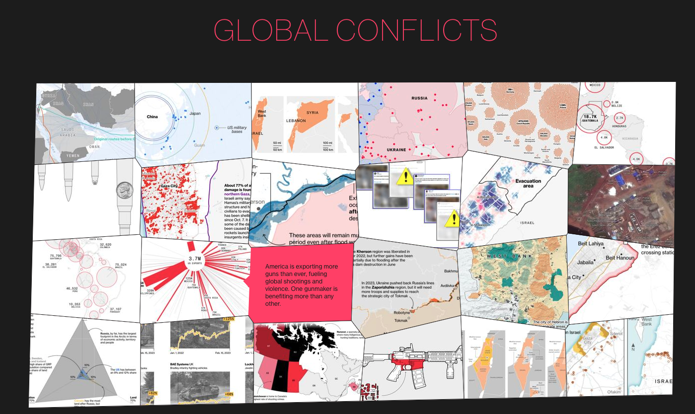
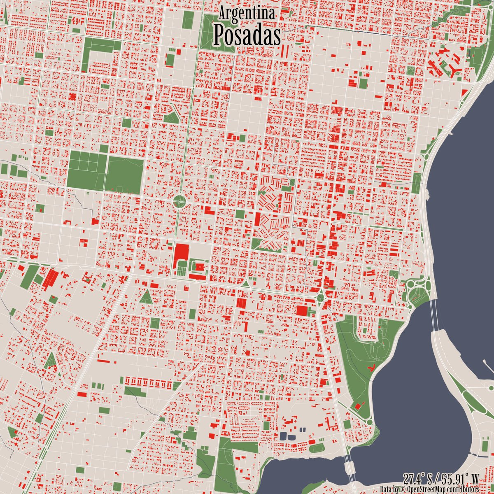
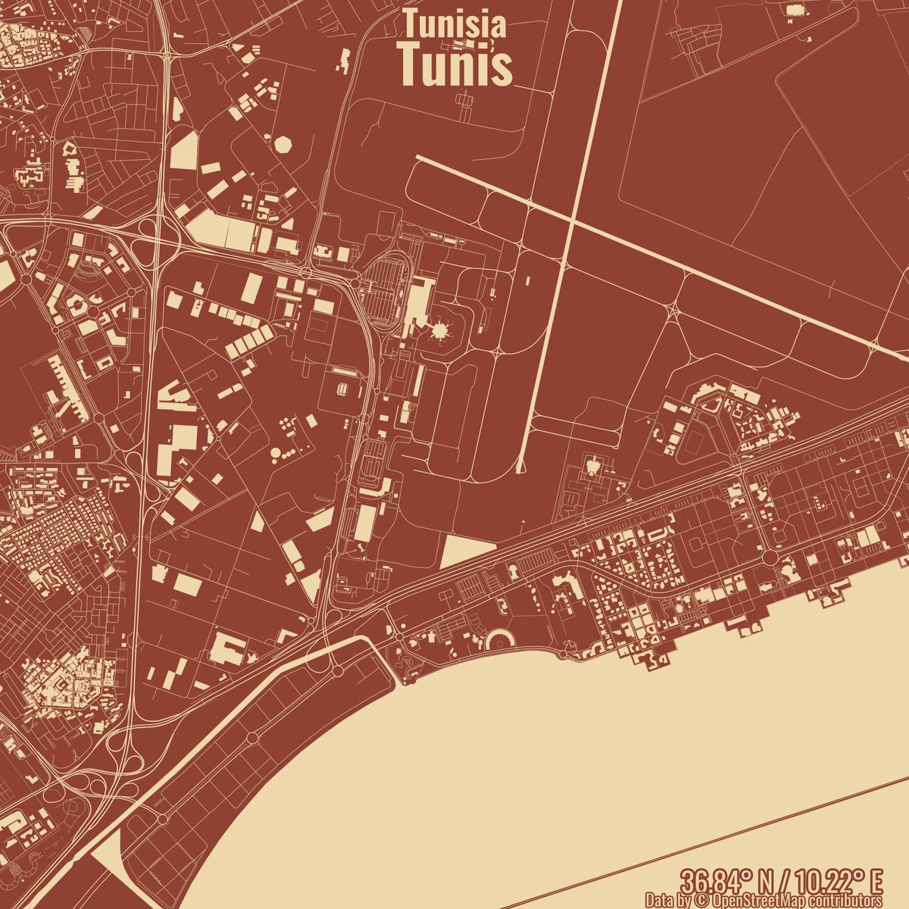
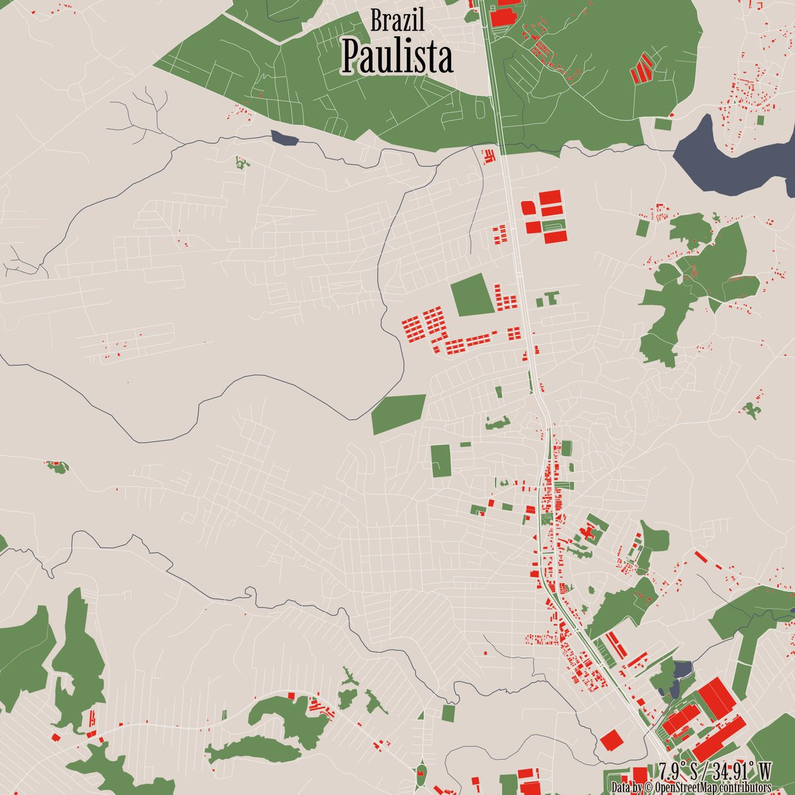
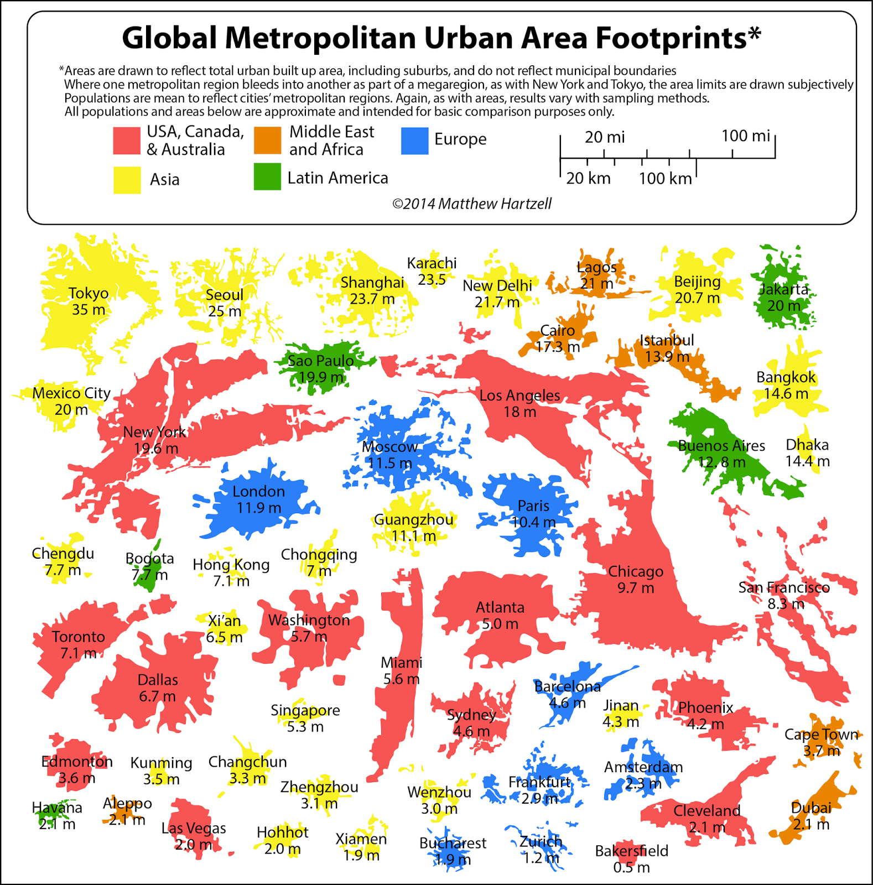

### The Year That Redrew the Energy Map

2024.12.4

https://www.bloomberg.com/graphics/2023-opinion-russia-ukraine-global-energy-transformation/

### 2023: The Year in Graphics, Data, Maps, and Visual Stories

https://www.bloomberg.com/graphics/2023-in-graphics/

2024.12.3

### R City Views

2024.12.2

### Urban Area Put Togeter

2024.12.2

https://geographyeducation.org/articles/comparing-urban-footprints/

