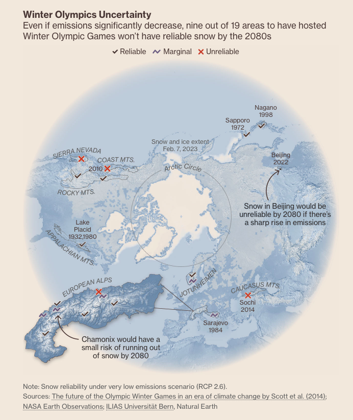

### Carbon

2024.12.4

https://www.bloomberg.com/graphics/2023-opinion-apple-supply-chain-climate-change/

### Snow

2024.12.4

https://www.bloomberg.com/graphics/2023-ski-area-resorts-climate-change/

### Data center energy use

2024.12.4 paper

**Recalibrating global data center energy-use estimates**, science, 2020

Growth in energy use has slowed owing to efficiency gains that smart policies can help maintain in the near term

### The Year That Redrew the Energy Map

2024.12.4

https://www.bloomberg.com/graphics/2023-opinion-russia-ukraine-global-energy-transformation/

### 2023: The Year in Graphics, Data, Maps, and Visual Stories

https://www.bloomberg.com/graphics/2023-in-graphics/

2024.12.3

### R City Views

2024.12.2

### Urban Area Put Togeter

2024.12.2

https://geographyeducation.org/articles/comparing-urban-footprints/

